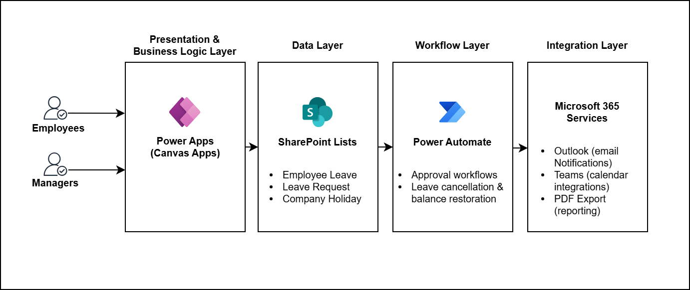
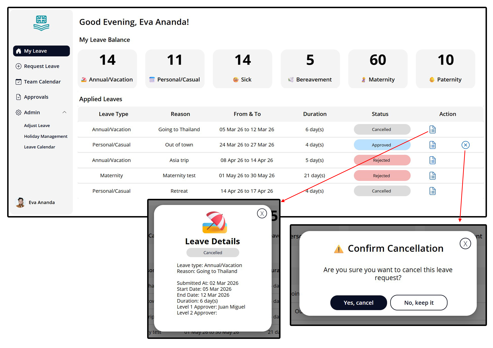
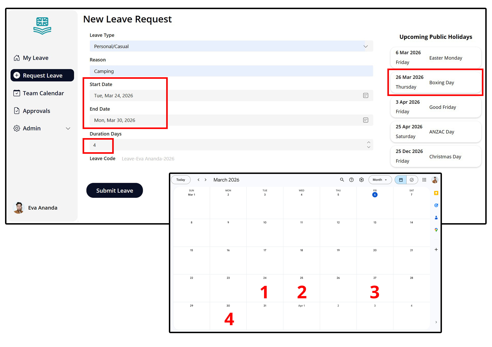
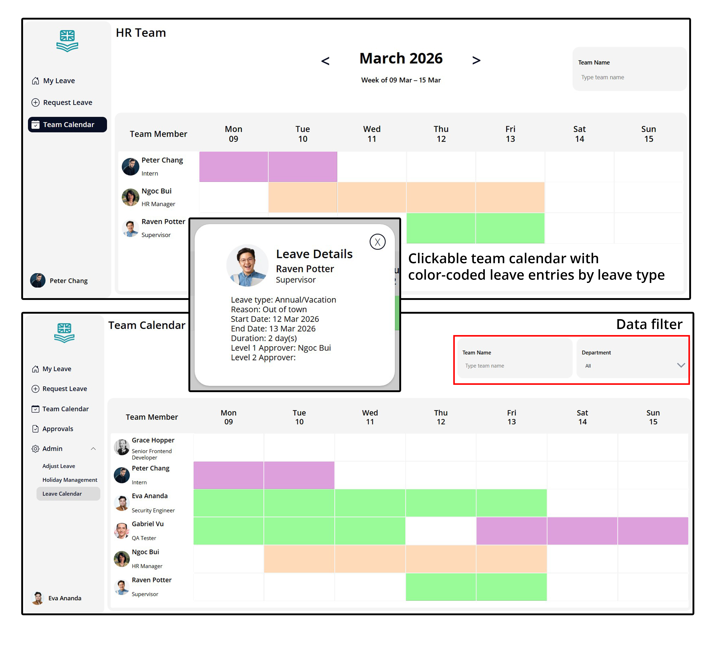
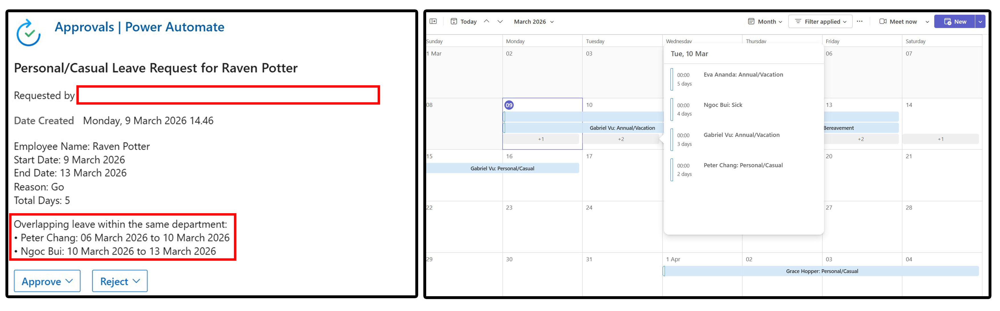
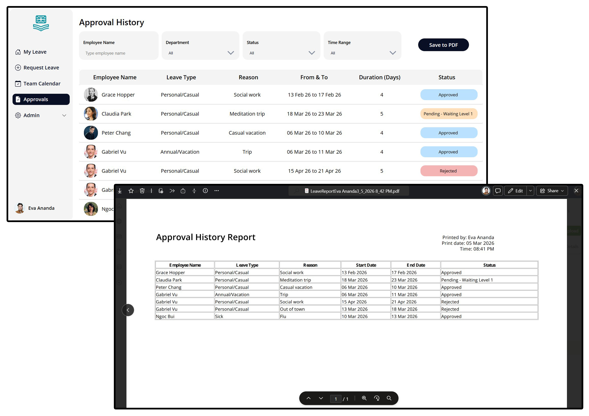

# Leave Management System - Power Apps

Built a fully functional leave management system within the Microsoft 365 ecosystem, enabling end-to-end leave request processing and approval workflows.

The application allows employees to submit leave requests through a dynamic form, which are automatically stored in SharePoint and trigger Power Automate approval workflows. Managers can review, approve, or reject requests directly, with real-time status updates reflected in the app.

The system also includes administrative capabilities for managing employee leave balances, configuring company holidays, and maintaining centralized records. Business logic is implemented to handle validation rules, leave type conditions, and automated status transitions.

## Technologies
- Microsoft Power Apps (Canvas)
- Power Automate ([See full Power Automate flow here](screenshots/all-flow.png))
- SharePoint
- Microsoft 365

## Key Features
- Leave request submission with automatic duration calculation
- Weekend and public holiday exclusion
- Overlap validation for leave requests
- Manager approval workflow
- Email notifications for approvals, rejections, and adjustments
- Leave balance tracking and automatic balance restoration

## Screenshots
### Dashboard

The main dashboard displays the employee’s leave balances and a list of submitted leave requests. Each request includes options to **view detailed information or cancel the request**. Cancellation is only allowed if the leave has been approved and the start date is more than 48 hours away.
### Leave Request Form

The leave request form automatically calculates the **leave duration while excluding weekends and public holidays.** The system also detects overlapping requests and displays a notification if the selected dates already have an existing request with the status **Pending (Level 1), Pending (Level 2), or Approved.**
### Team Calendar

This page shows a weekly leave calendar for employees within the same department, allowing team members to quickly see who is on leave. On the **administrator view**, the calendar displays leave schedules for **all employees across departments.**
### Approval Workflow & Conflict Awareness

When an employee submits a leave request, the system checks whether the dates overlap with other employees’ leave within the same department. This information is shown as **FYI context for the approver** in the Microsoft approval interface. Once approved, the leave entry is automatically **added to the Microsoft Teams calendar.**
### Approval History

Managers can review all leave requests that have been sent to them through the **approval history page**. The records can also be **exported as a PDF file for documentation or reporting purposes.**
